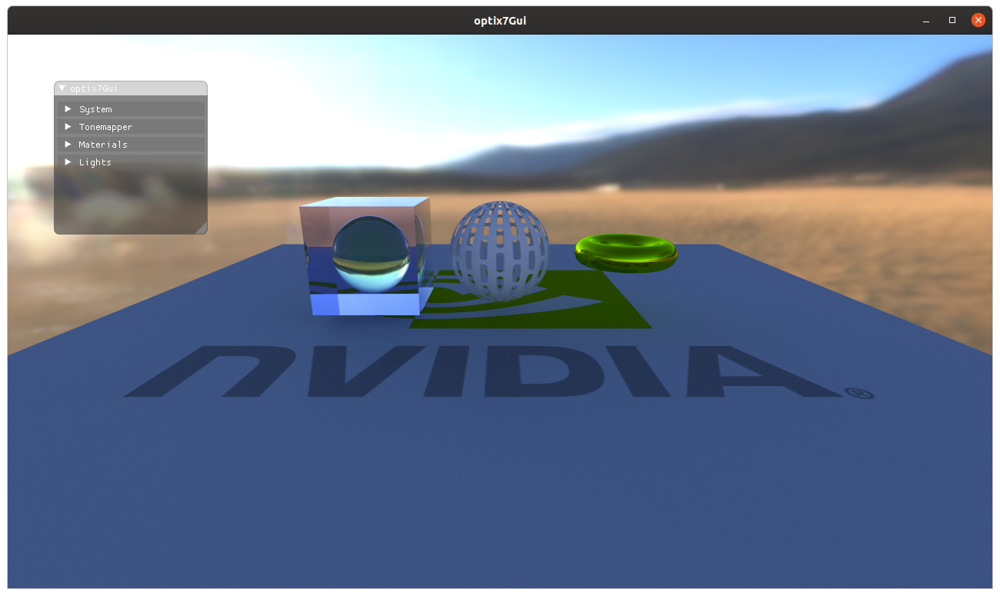
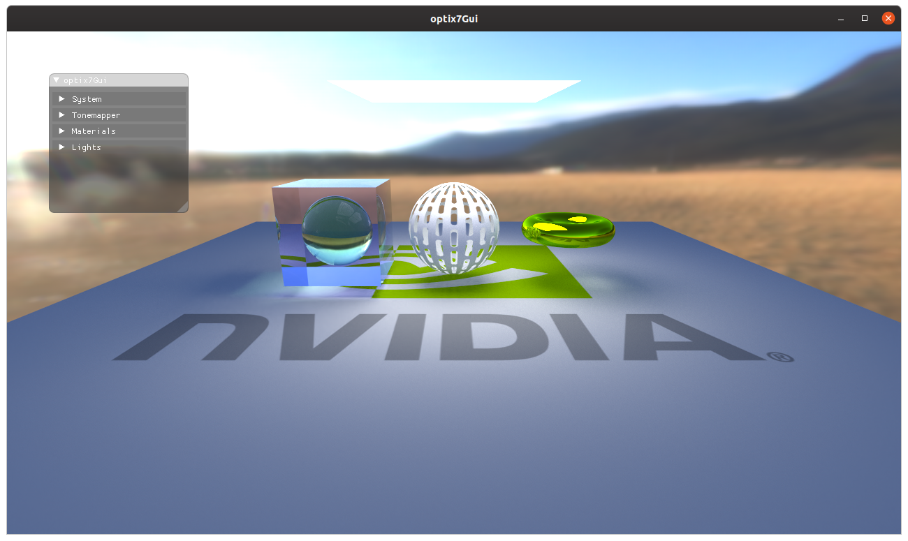

tweeker_raytracer
=================

Experimental raytracing test bed.



Name is a play on my earlier project `weeker_raytracer`. This repo is spun out of [weeker_raytracer](https://github.com/idcrook/weeker_raytracer), which itself was based on Ray Tracing In One Weekend series by Peter Shirley.

Pre-requisites
--------------

Tested on Ubuntu Linux 19.10 on an x86-64 system with RTX GeForce card.

-	Uses CMake to build.
-	Uses [conan](https://conan.io/) for some C++ library package management
-	Requires CUDA SDK and tools and Optix SDK(s) to be installed locally to build/link.

Refer to `notes` directory contents, including [optix install](notes/optix/install.md)

Uses conan as C++ dependency manager. In general this means

1.	Install conan: https://docs.conan.io/en/latest/installation.html
2.	Clone this repo
3.	Install dependencies using conan or system package manager
	-	Generate dependency package cmake includes (via `conan`\)
	-	Use CMake to generate Makefiles
	-	Use cmake to compile/build project sources and libs
4.	Run

### install dev dependencies

```shell
sudo apt install libglvnd-dev libglfw3-dev libglew-dev
#   includes libgl1-mesa-dev as dependency (OpenGL headers)
```

### Other Third-party dependencies

In addition to baseline requirements of CUDA SDK and Optix 6.5 and/or Optix 7.0 SDK (refer to `notes` directory for how I did it) there are addition libraries to links into the apps.

#### Install DevIL developer image library

http://openil.sourceforge.net/

Available via system package manager.

```shell
sudo apt install libdevil-dev
```

Installing `-dev` package also brings in the library package.

Apps
----

`optixGui`
----------

-	[OptixGui](apps/OptixGui) - based directly on https://github.com/nvpro-samples/optix_advanced_samples/tree/master/src/optixIntroduction

OptiX 6.5 imgui

-	Uses imgui (via GLFW + OpenGL3 via GLEW)
	-	Installed using conan.io
-	Uses DevIL image library
-	Assumes [optix_advanced_samples](https://github.com/nvpro-samples/optix_advanced_samples) repo is available for its texture files

See respective [README.md](apps/OptixGui/README.md) for build instructions and `conanfile.txt` for dependencies.

`optix7Gui`
-----------

-	[Optix7Gui](apps/Optix7Gui) - based directly on https://github.com/NVIDIA/OptiX_Apps/tree/master/apps/intro_denoiser

OptiX 7 imgui

-	Uses imgui (via GLFW + OpenGL3 via GLEW)
	-	Installed using conan.io
-	Uses DevIL image library
-	Assumes [OptiX_Apps](https://github.com/NVIDIA/OptiX_Apps) repo is available for its texture files

See respective [README.md](apps/Optix7Gui/README.md) for build instructions and `conanfile.txt` for dependencies.

Build on Linux
--------------

IMPORTANT: Refer to respective readme for pointing to texture files.

-	[OptixGui README](apps/OptixGui/README.md)
-	[Optix7Gui README](apps/Optix7Gui/README.md)

```bash
# navigate to top-level of this repo
cd tweeker_raytracer

OPTIX7_PATH=/usr/local/nvidia/NVIDIA-OptiX-SDK-7.0.0-linux64 \
OptiX_INSTALL_DIR="/usr/local/nvidia/NVIDIA-OptiX-SDK-6.5.0-linux64/" \
cmake \
    -B build .

# this will build all targets
cmake --build build --parallel 7

# can specify a target
cmake --build build --target optixGui  --parallel 7
cmake --build build --target optix7Gui --parallel 7
cmake --build build --target rtigo3    --parallel 7

```

### Run

After a successful build

```shell
cd tweeker_raytracer # top-level directory again

build/apps/OptixGui/bin/optixGui -h
build/apps/Optix7Gui/bin/optix7Gui -h

# optixGui - FIXME: update path handling
OPTIX_SAMPLES_SDK_PTX_DIR=`pwd`/build/lib/ptx \
    build/apps/OptixGui/bin/optixGui

# optix7Gui - FIXME: top-level build cannot locate internal texture images
build/apps/Optix7Gui/bin/optix7Gui

# rtigo3 - FIXME: app crashes if image textures are not found
cd apps/rtigo3/data
/path/to/tweeker_raytracer/build/apps/rtigo3/bin/rtigo3 \
  -s ./system_rtigo3_cornell_box.txt -d ./scene_rtigo3_cornell_box.txt
```

#### libGL / Mesa linked library loading issues

If you get an error like

```
MESA-LOADER: failed to open swrast (search .conan/data/mesa/19.3.1/bincrafters/stable/package/a56cf85a12b68f87c51b8bc2331fe996caedb686/lib/dri)
libGL error: failed to load driver: swrast
Glfw Error 65543: GLX: Failed to create context: BadMatch
```

Something like this may help

```
build/apps/Optix7Gui/bin/optix7Gui || \
  LD_PRELOAD=$LD_PRELOAD:/lib/x86_64-linux-gnu/libGL.so \
  build/apps/Optix7Gui/bin/optix7Gui || \
    LD_LIBRARY_PATH=/usr/lib/x86_64-linux-gnu build/apps/Optix7Gui/bin/optix7Gui
```

Image renders and screencaps from `optixGui`
--------------------------------------------


 Light, nested materials

 image textures including environment map

 denoiser OFF, 8 samples per pixel

 denoiser ON, 8 samples per pixel

 Alternate environment, light, 1k samples per pixel

Image renders and screencaps from `optix7Gui`
---------------------------------------------

 optix7Gui, alternate environment, light, running in app.
