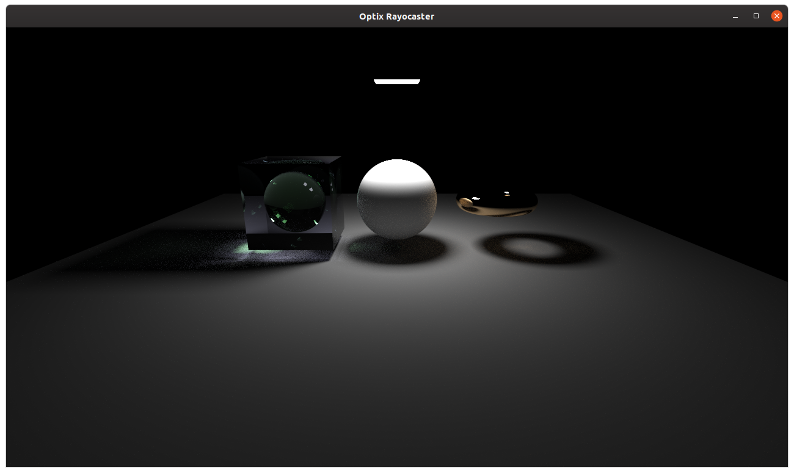

tweeker_raytracer
=================

Experimental raytracing test bed.


Name is a play on my earlier project `weeker_raytracer`. This repo is spun out of [weeker_raytracer](https://github.com/idcrook/weeker_raytracer), which itself was based on Ray Tracing In One Weekend series by Peter Shirley.

Pre-requisites
--------------

Tested on Ubuntu Linux 19.10 on an x86-64 system with RTX GeForce card.

-	Uses CMake to build.
-	Uses [conan](https://conan.io/) for some C++ library package management
-	Requires CUDA SDK and tools and Optix SDK(s) to be installed locally to build/link.

Refer to `notes` directory contents, including [optix install](notes/optix/install.md)

Uses conan as C++ dependency manager. In general this means

1.	Install conan: https://docs.conan.io/en/latest/installation.html
2.	Clone this repo
3.	Install dependencies using conan or system package manager
	-	Generate dependency package cmake includes (via `conan`\)
	-	Use CMake to generate Makefiles
	-	Use cmake to compile/build project sources and libs
4.	Run

### Other Third-party dependencies

In addition to baseline requirements of CUDA SDK and Optix 6.5 and/or Optix 7.0 SDK (refer to `notes` directory for how I did it) there are addition libraries to links into the apps.

#### Install DevIL developer image library

http://openil.sourceforge.net/

Dependency not available in `conan` but should be available via system package manager.

```shell
sudo apt install libdevil-dev
```

Installing `-dev` package also brings in the library package.

Apps
----

`optixGui`
----------

-	[OptixGui](src/OptixGui) - based directly on https://github.com/nvpro-samples/optix_advanced_samples/tree/master/src/optixIntroduction

OptiX 6.5 imgui

-	Uses imgui (using GLFW and OpenGL3 via GLEW)
	-	These are installed using conan.io
-	Uses DevIL image library
-	Assumes [optix_advanced_samples](https://github.com/nvpro-samples/optix_advanced_samples) repo is available for its texture files

See respective [README.md](src/OptixGui/README.md) for build instructions and `conanfile.txt` for dependencies.

`optix7Gui`
-----------

-	[Optix7Gui](src/Optix7Gui) - based directly on https://github.com/NVIDIA/OptiX_Apps/tree/master/apps/intro_denoiser

OptiX 7 imgui

-	Uses imgui (using GLFW and OpenGL3 via GLEW)
	-	These are installed using conan.io
-	Uses DevIL image library
-	Assumes [OptiX_Apps](https://github.com/NVIDIA/OptiX_Apps) repo is available for its texture files

See respective [README.md](src/Optix7Gui/README.md) for build instructions and `conanfile.txt` for dependencies.

Build
-----

Refer to

-	[OptixGui README](src/OptixGui/README.md)
-	[Optix7Gui README](src/Optix7Gui/README.md)

### Run

After a successful build

```shell
cd tweeker_raytracer # top-level directory again
# run
build/optixGui [options]
```

Image renders and screencaps from `optixGui`
--------------------------------------------


 Light, nested materials

 image textures including environment map

 denoiser OFF, 8 samples per pixel

 denoiser ON, 8 samples per pixel

 Alternate environment, light, 1k samples per pixel
